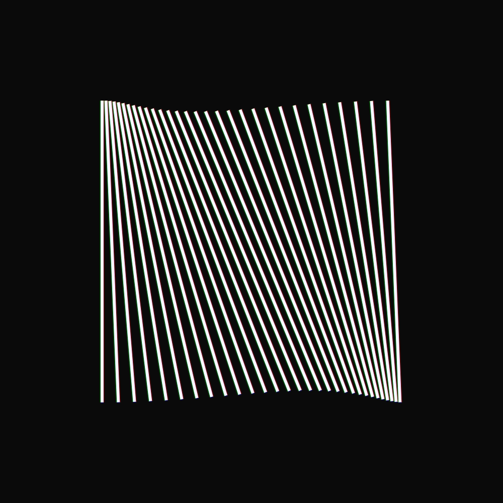
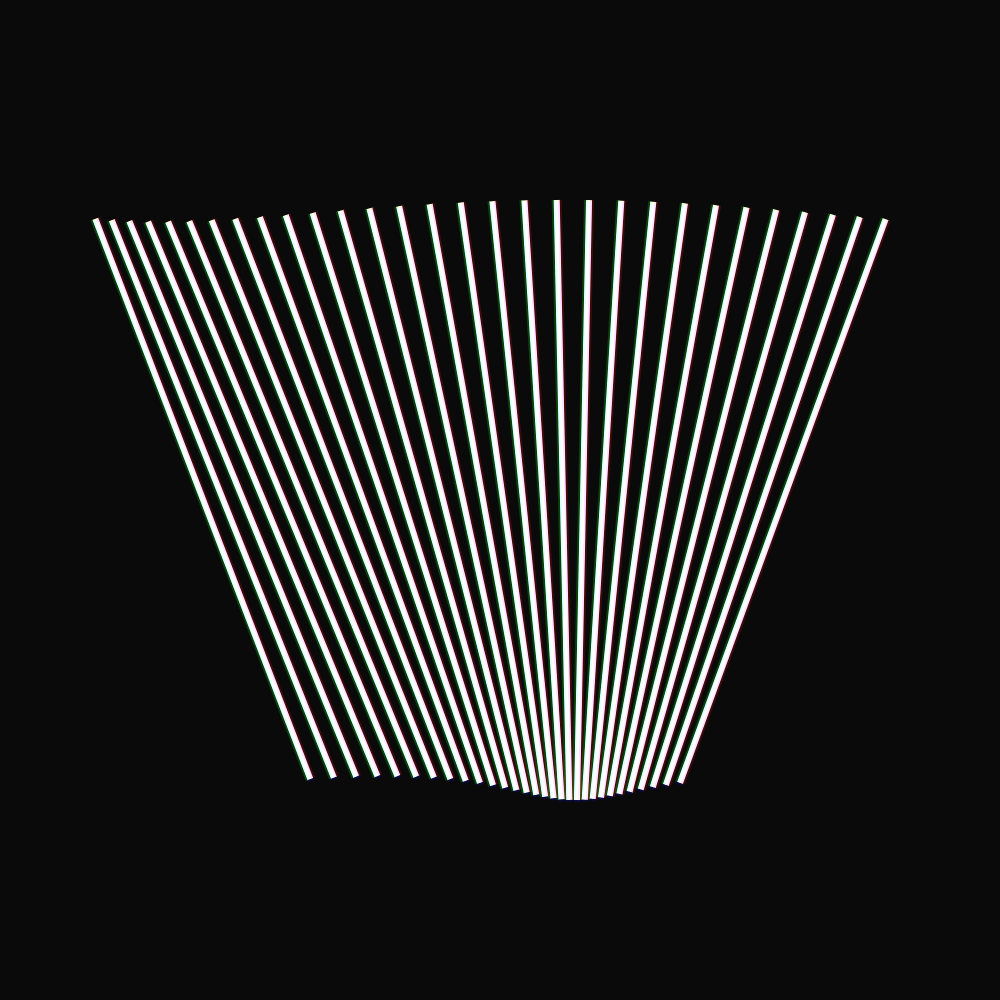
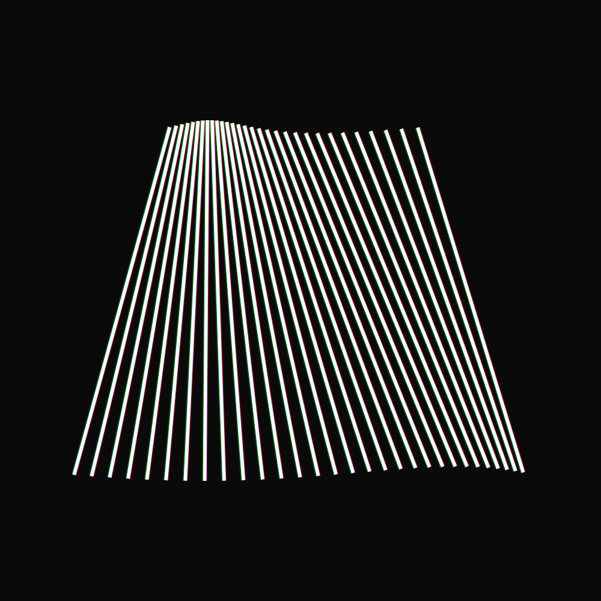

# Lines

Look at them! Look!

So thin, so long. So rotating! So mesmerizing!

## What?

There is not much to say about this (very small) project. I have been always VERY inspired by the work of [Nikita Iziev](https://nikitaiziev.com/), a London based graphic designer. I wouldn't be surprised if you found something similar in his profile.

The project is made by animating a few shapes on a HTML5 canvas using only simple rotations and translations. A small **chromatic aberration-like** effect is also slightly visibile around the edges of the rectangles. I think I will look into it slightly more because I like the effect. The single frames were then saved using [CCapture.js](https://github.com/spite/ccapture.js/) and rendered as a video using FFmpeg.

In order to get started faster on my canvas projects (I made quit a lot of them recently, I will start publishing them soon both here and on my [Instagram account](https://www.instagram.com/lorossi97)) I made a template (or a boilerplate, I don't really know the terminology used in here) that I keep developing and improving to ease the pain that using canvas might cause.

I could use [P5js](https://p5js.org/) as it's easy to use and understand but it takes too much on a hit on FPS (a simple animation like this would run VERY choppily on a phone, with less than 20fps) and it's not very flexible for an advanced user. That said, I do use it a lot (throught the [web editor](https://editor.p5js.org/) or throught it's older brother [Processing](https://processing.org/)) to make prototypes and toy around with ideas flying in my mind.

This time I won't provide a link to the sketch since there's no interactivity or anything that could be improved via the direct source.

## Videos and images

Since I can't place videos inside this readme, I can only link my [Instagram post](https://www.instagram.com/p/COARvNIs9mh/) where I published the whole animation. I can however show animations in here.

A full video (the same as the one that you can find by following the link) is also available in the `output` folder of this repo.

## License

This project is distributed under Attribution 4.0 International (CC BY 4.0) license.
